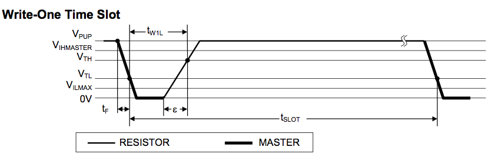

# AtomeWire Specification

_This document intends to describe the AtomeWire protocol based on the 1-Wire protocol (described in the datasheet of the DS2413 found [here](https://datasheets.maximintegrated.com/en/ds/DS2413.pdf))._

## Overview

The protocol has basically 3 stages. These are always followed to execute an action.

1. Reset and Presense Squence
2. Send selection command or search command
3. Send get or set command

One exception is the search. The selction command is actually the search command and the search starts immediatly.

## Message format and timing

Timing is really important in the one wire protocoll and thus every sequence message has a strict time limit. The following describes the sequences and timings. The timing values are listed in a big table that can be found [here](https://docs.google.com/spreadsheets/d/1yPVSfb1niXWbVkhceOln84PVQOyeUlXaM6V_9AKL58c/edit?usp=sharing). It compares the DS2413 datasheet 1-Wire values with the AtomWire code and contains the values used in the AtomWire+ implementation.

### Reset and Presence Sequence

_This sequence is desribed from the masters point of view._

To initiate an iteration of the protocol and align the timing of all slaves the master starts of with a presence pulse by pulling the line low for `t_RSTL`. After that the master goes into receive mode and the line is pulled high by the pull up resistor. After `t_PDH` the slaves respond with a presence pulse by pulling the line low for `t_PDL`. The master measures the pin at `t_MSP` if it's low it knows there is at least one slave on the line. Otherwise it knows that there is no slave connected. When the slaves release the line it goes high again and after `t_REC` the slaves are ready to receive a select or search command. The presence squence takes `t_RSTH`.

The following communication happens in time slots (`t_SLOT`). The master initiates every communication by pulling the line low.

### Write

#### Master

The following writes are from the perspective of the master. This means he is transmitting data to the slaves.

##### Write-One

To write a one the master pulls the line low for no longer than `t_W1LMAX` and then releases it. Thus it goes high again. After `t_SLOT` is expired the next transmission can happen.

##### Write-Zero

To write a zero the master pulls the line low for at least `t_W0LMIN` and then relases it to go high again. It stays high for at least `t_RECMIN`. After `t_SLOT` is expired the next transaction can happen.

#### Slave

The following writes are form the perspecitive of the slave. This means he is sending data to the master. 

This graphic shows both the writing of a one or a zero on the wire. To check if the next slot starts the slave waits from 0 up to `t_W1MAX` until the line is height and then waits for up to `t_W0MAX` for the line to be driven low by the master. Now depening on the bit it does nothing for a 1 (it will pull up automaticlaly) for `t_W1L` or pulls the line low to write a 0 for `t_W0L`.

### Read

#### Master

This is described from the perspective of the master and means the slaves are sending/writing and the master is receiving/reading.

To initiate a read sequence the master pulls the line low for `t_RL` and then releases it. After `t_MSR` the master will read the line. Then he waits for `t_SLOT` to expire until the next read or write can happen.

#### Slave

This is described from the perspective of the slave and means the master is sending/writing and the slaves are receiving/reading.

First the slave waits until the start of the next sequence. This done by waiting up to `t_W1RMAX` until the line becomes hight and then waiting up to `t_W0RMAX` until it it driven low by the master. Now it waits `t_SLR` until it reads the line.

## Selection and search commands

### Match ROM `0x55`

This command is immediatly followed by an AtomWire ID to defines a slave in the network. Thus it selects a specific slaves. If two slaves have the same ID data collision occures. Other slaves on the network stop communication until the next reset pulse is detected.

### Skip ROM `0xCC`

This skips the ROM selection (Match ROM) and is useful if there's only one slave on the network. Otherwise data collition will occure.

### Resume `0x69`

Selects the last AtomWire device that was successfully selected via a Match ROM or Skip ROM command.

### Search ROM `0xF0`

This initates a search. See Search section for an description of how it works.

### Read ROM `0x33` (deprecated)

Requests the serial device of a slave. If multiple slaves are on the network, data collision will occur and the data received will not be valid.

## Get and set commands

### GPIO write `0x8X`

This set the GPIO pins (0 - 3) to the lower 4 bits of the command (`X`). The bits are assigned form the lowest to the highest bit to pin 0 - 3 respectively. (i.e. pin 0 = bit 0, bit 1 = bit 1, ...)

### Set block type `0x1X` `0x2X` `0x4X`

This sets the block size to 1x1, 1x2 and 2x2 respectively. The lower 4 bits define the ID of the node inside this block. It is between 0 and maxBlockSize - 1, where maxBlockSize is 1, 2 and 4 respectively.

### Read scratchpad `0xBE`

Returns the contents of the scratchpad wihout updating (reading) the current GPIO pin values.

### Read GPIO poins `0xA1`

Returns the contents of the scratchpad with updated (read) GPIO values.

## Search

An explanation of the current 1-Wire search algorithm used can be found [here](https://www.maximintegrated.com/en/app-notes/index.mvp/id/187).